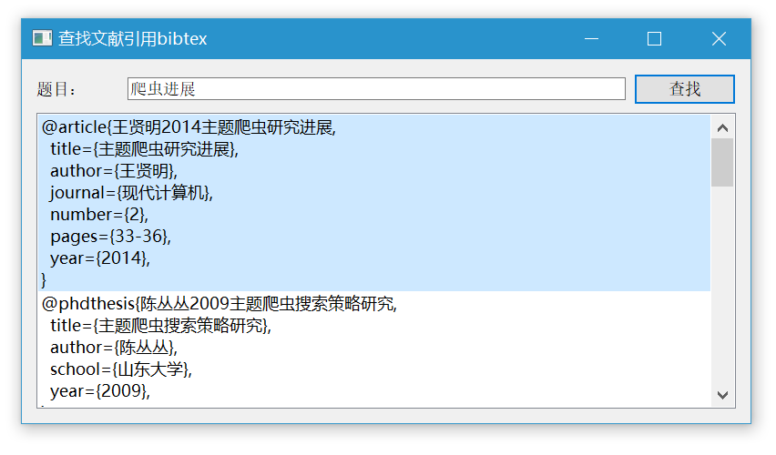

# Baidu_BibTeX

使用LaTeX编写论文时，需要使用BibTeX格式的参考文献。一开始使用chrome的google scholar button插件查找文献，每次都需要经过“搜索文献--》点击引用--》弹出‘APA’等格式的对话框--》点击对话框左下角的BibTeX--》弹出新网页，复制bibtex字段”，文献少的时候还能忍，多了就显得很麻烦，并且，搜索多了google还可能会弹出验证或直接封IP（血的教训）。


尝试了微软学术、搜狗学术（竟然是调用的微软学术的api），搜索结果太杂。虽然知道了文献id，就可以直接通过api获得bibtex，但是有时候搜索结果的第一页都不是想要的，体验太差。

于是转向百度，百度也是需要和google一样繁琐的步骤。无奈之下，决定自己造个轮子。检索文献，直接出来bibtex字段。


## 使用方法



1、打开“baidubibtex.exe”。弹出如图所示界面。

2、在输入框中输入需要检索的文献题目，直接回车或者点击右边的查找按钮。

3、等待一会（程序可能出现假死现象，这是由于正在爬取网页）

4、输入框下方出现检索的bibtex结果，选中一栏，直接‘Ctrl+C’复制，就可以将bibtex字段粘贴到你需要粘贴的地方。


## 原理

利用python的selenium库模拟使用网页检索文献获取bibtex的过程，爬取检索结果中的第一页的内容，将bibtex显示在listwidget中。

若要运行源码。可能需要的依赖：

- selenium库
- pyQt5
- chromedriver


打包源码：

```python
pyinstaller -F baidubibtex.py
```


